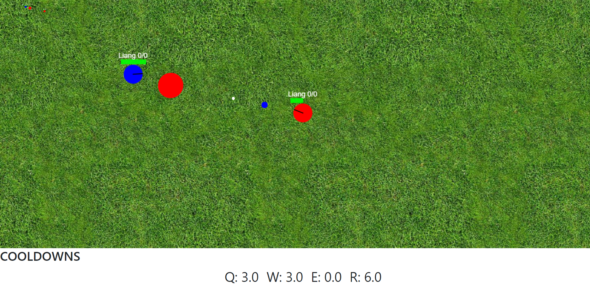

Was kinda bored and I liked making games, so I decided to make this app.

## How to play
Basically go to [game.stuffbyliang.com](https://game.stuffbyliang.com/) and enter a username. Get your friends to join. Change your team and abilities at [game.stuffbyliang.com/settings](https://game.stuffbyliang.com/settings)

## Features
- Multiple players
- 10 abilities
- Multiple teams
- Lotso fun

## Lessons learned
I've learned that making games require a LOT of math. Making a 2d game requires knowledge of basic trigonometry, since I'm working in 2d cartesian plane. In addition, collision checking also requires its own mathematical formulas.

## Areas of improvement
- I can further compartmentalize and modularize the code, it's a bit like spaghetti right now.

## Important Design Choices I made
- I've abstracted a projectile class that contains many important actions related to the abilities - this saved lots of time coding the current 10 abilities.